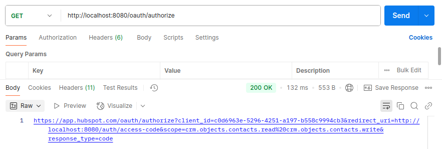
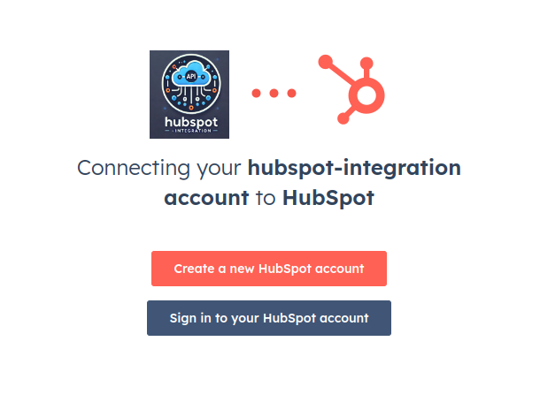
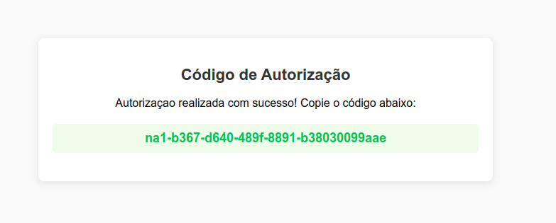
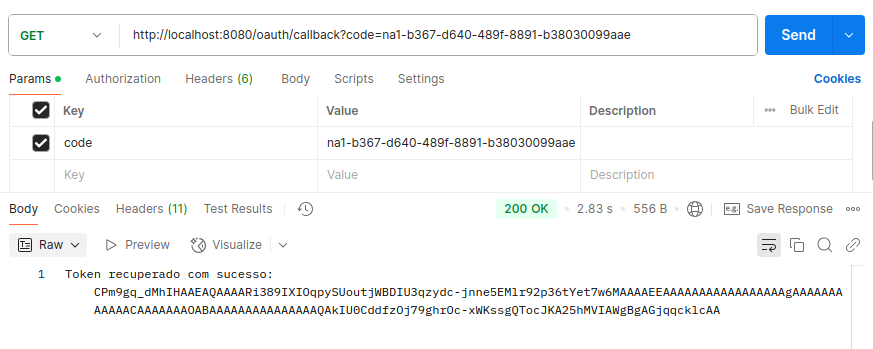
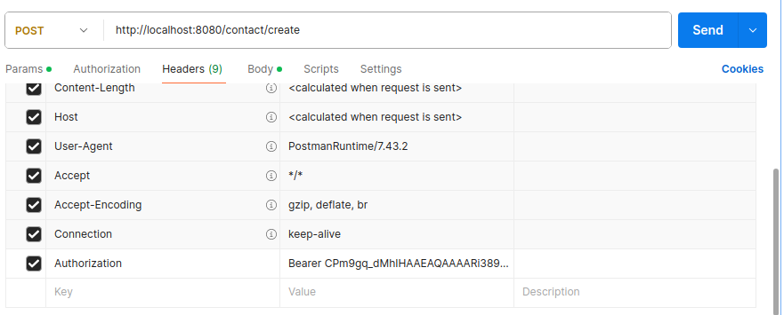
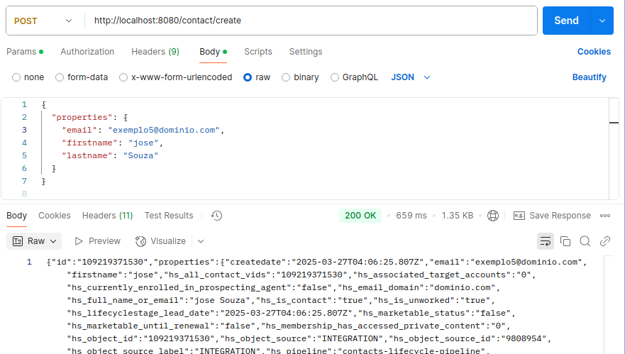

# Hub Spot Integration

**API REST em Java** para integrar com a **API do HubSpot**, implementando autenticação via **OAuth 2.0**, mais especificamente com o fluxo de **authorization code flow**, a implementação de endpoint de integração com a API e o recebimento de notificações via **webhooks**.

## Pré-requisitos

Antes de executar o projeto, certifique-se de ter:

- Uma **[conta gratuita de desenvolvedor HubSpot](https://app.hubspot.com/signup-hubspot/developers?step=landing_page)**
- **[Java 17](https://www.oracle.com/java/technologies/javase/jdk17-archive-downloads.html)** ou superior (o projeto está usando a versão 17)
- **[Maven 3.8](https://maven.apache.org/download.cgi)** ou superior (o projeto está usando a versão 3.9.9)
- **Spring Boot 3.4.x** ou superior (o projeto está usando a versão 3.4.4)

Você pode verificar as versões instaladas com os seguintes comandos:
```bash
$ java -version
$ mvn -version
```

## Instruções Para Executar a Aplicação

1. Clone o repositório:
   ```bash
   $ git clone https://github.com/RaquelAmbroziof/hubspot-integration.git
   ```
2. Navegue até o diretório da aplicação:
   ```bash
   $ cd hubspot-integration
   ```
3. Limpe e compile a aplicação:
   ```bash
   $ mvn clean install
   ```
4. Rode o projeto:
   ```bash
   $ mvn spring-boot:run
   ```
## Endpoints

| Método | Rota                          | Descrição                                                         |
|--------|--------------------------------|-------------------------------------------------------------------|
| GET    | `/oauth/authorize`             | Retorna a URL de autorização.                                     |
| GET    | `/oauth/callback?code=`        | Recebe o código de autorização fornecido pelo HubSpot e retorna o token de acesso. |
| POST    | `/contact/create`        | Recebe o código de autorização fornecido pelo HubSpot e retorna o token de acesso. |

## Como Testar a Aplicação
Na raiz do repositório, você encontrará uma coleção do Postman contendo todas as requisições necessárias para testar os endpoints da API. Para utilizá-la, basta fazer o download e importá-la no seu Postman:
[Download da coleção Postman](https://github.com/RaquelAmbroziof/hubspot-integration/blob/main/HUBSPOT.postman_collection.json)


1. Com a aplicação rodando, faça uma requisição GET para `http://localhost:8080/oauth/authorize`. Isso gerará a URL de autorização.
   
   

2. Crie uma nova conta ou faça login para autorizar.
   
   

3. Após autorizar, o HubSpot redirecionará você para uma página onde o código de autorização será exibido. Copie o código de autorização. 
  

4. Faça uma requisição GET para `http://localhost:8080/oauth/callback?code={seuCodigo}`, substituindo `{seuCodigo}` pelo código copiado no passo anterior.
  

5. O HubSpot retornará o token de acesso. Copie o token em seguida, faça uma requisição POST para `http://localhost:8080/contact/create` para criar um novo contato.
6. Inclua o token de acesso no cabeçalho da requisição.


7. Inclua o body e envie a requisição.


## Decisões Técnicas

Durante o desenvolvimento da integração com a **API do HubSpot**, tomei algumas decisões, em geral, escolhi pelas ferramentes em suas versões mais recentes e estáveis:

- **Java 17 e Spring Boot**: Utilizei Java 17 pela sua estabilidade e Spring Boot para simplificar a criação da API RESTful e a integração com OAuth 2.0.
- **Maven**: Adotei Maven para gerenciamento de dependências e automação do build.
- **Dependências Importantes**:
  - **Spring Boot Security** e **Spring Boot Web**: Para garantir a segurança e criar a estrutura de uma API RESTful.
  - **WebClient e Spring WebFlux**: Utilizados para realizar requisições HTTP assíncronas e não bloqueantes, melhorando a escalabilidade e a performance.
  - **Lombok**: Para reduzir o código boilerplate, tornando o código mais limpo e legível.
  - **Jackson Databind**: Para manipulação de dados JSON, essencial para interagir com a API do HubSpot.
- **Gerenciamento de Tokens**: Criei uma classe específica para gerenciar o token de acesso. Essa classe armazena e reutiliza o token durante as requisições subsequentes, evitando a necessidade de reautenticação a cada solicitação.
- **Segurança**: Garantir a segurança dos dados foi uma prioridade, usando OAuth 2.0 e cabeçalhos de autorização.
- **Postman Collection**: Criei uma collection no Postman para facilitar os testes da API.
- **Spring Cloud**: Adotei o **Spring Cloud** para facilitar a integração com arquiteturas distribuídas, caso seja necessário expandir a aplicação no futuro.

Essas decisões visam otimizar a segurança, a escalabilidade e a simplicidade do sistema.

## Melhorias Futuras

Abaixo estão algumas possíveis melhorias para o futuro:

**Testes**
   - Implementar testes unitários e de integração com a API do HubSpot.
**Documentação da API**
   - A documentação da API poderia ser melhorada usando ferramentas como Swagger/OpenAPI com a adição de exemplos de requisições e respostas, além de uma descrição mais detalhada de cada endpoint.
**Melhorar Gerenciamento dos Tokens**
   - Gerenciar melhor os tokens com permanência em Banco de Dados ou cache (como Redis). Isso permitiria a aplicação lidar com tokens expirados de maneira mais eficiente e evitar reautenticações desnecessárias.
**Melhorias no Gerenciamento de Erros**
   - Embora o sistema já trate de erros de forma básica, poderia implementar uma estratégia mais robusta de gerenciamento de erros, com códigos de status HTTP mais detalhados e mensagens de erro mais informativas. 
**Suporte a Outras APIs do HubSpot**
   - A integração com a **API do HubSpot** poderia ser expandida para incluir outras funcionalidades, com criação e gerenciamento de mais recursos. 
**Deploy em Ambiente de Produção**
   - Atualmente, o projeto está configurado para rodar localmente. O próximo passo seria preparar o ambiente para produção.


